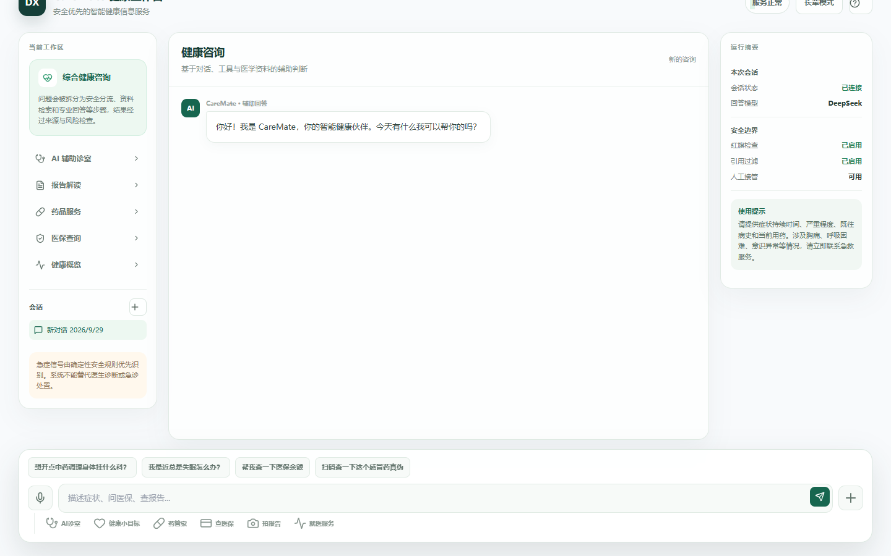

# CareMate — 面向医疗健康场景的 Agent 工作台

本项目最初参考[Smart Health Assistant](https://github.com/wananing/Smart-Health-Assistant)的思路，后续重塑架构以及增加了后端的内容。CareMate 是一个面向医疗健康信息服务的全栈 Agent 项目。它将 LangGraph 多智能体编排、Agent Runtime、Agentic RAG、用户记忆、医疗安全 Harness、流式 UI 和可观测性整合在同一条端到端链路中。

项目目标不是让模型“直接回答所有问题”，而是让 Agent 在医疗场景中安全地分流意图、动态调用工具、反复检索证据、保留必要的用户上下文，并在输出前经过确定性规则和 Verifier 门禁。

## 运行效果

当前前端品牌为 **CareMate 健康工作台**，支持：

- 多会话列表、新建会话、会话切换和历史消息恢复
- 综合健康咨询、AI 辅助诊室、报告解读、药品服务、医保查询和健康概览
- 流式回答、Agent 节点状态、工具调用进度和结构化结果卡片
- 长辈模式：更大的字号、更高的对比度和更简化的操作
- 桌面端与窄屏端自适应布局，聊天区和会话区均支持滚动

截图：



## 核心架构

```text
React / TypeScript / Vite
          │ SSE 流式事件 + 结构化 UI 卡片
FastAPI API Layer
          │
Agent Runtime（预算、超时、重试、暂停/恢复、运行状态）
          │
LangGraph Orchestrator
  ├─ Intent Gate / Router
  ├─ Planner
  ├─ Executor（工具与领域 Agent）
  ├─ Verifier / Evidence Gate
  └─ Responder
          │
Agentic RAG + Memory + Skills + Safety Harness
          │
MySQL / Redis / Chroma / MinIO / Jaeger
```

## Agent 能力

### Agent Runtime

Runtime 为 LangGraph 提供统一的执行控制层，并不替代 LangGraph：

- 限制总步数、工具调用次数和 token 预算
- 对模型、工具和 Agent 任务执行超时、重试和退避
- 保存运行状态，支持 Agent Run 查询、暂停和恢复
- 对异常、失败任务和运行指标进行结构化记录
- 通过统一的运行上下文传递用户、会话、预算和 trace 信息

### Agentic RAG

知识库不是固定的前置步骤，而是 Agent 可以反复调用的工具。Agent 会根据问题规划检索，观察证据质量，在证据不足时改写查询并继续检索，最后由证据门禁判断是否足以支撑回答。

- BM25 + 向量检索 + RRF 融合
- 父子块索引，兼顾章节语义和局部证据精度
- 来源级 Recall@3、MRR 和引用忠实度评估
- DeepSeek 可作为 reranker / LLM-as-a-Judge
- 支持普通 RAG 与 Agentic RAG 对照评测

### Memory 与自进化

记忆分为稳定偏好、近期状态和健康事件三层：

- 用户画像与表达偏好：年龄、专业程度、长辈模式、回答风格
- 近期状态：例如“近几天持续询问感冒”，可在康复后降低上下文权重
- 健康事件记录：保留生病/康复历史，但避免已结束事件污染当前回答
- 每若干轮对话触发影子记忆 Agent，提取可验证、可回滚的偏好更新
- 用户记忆采用版本化部署，支持 rollback / reset，避免错误记忆永久影响回答

### 医疗安全 Harness

采用“模型输出 + 确定性急症规则 + 工具结果 + Verifier 门禁 + 紧急否决”的多层防护，确定性规则优先级高于模型输出。

- 内置 23 条急症识别规则
- 禁止确诊、开药、伪造引用等高风险行为
- 高危场景触发紧急拦截和就医建议
- 安全评测集覆盖红旗识别、风险分级、提示注入和过度拦截

## 可观测性与评测

项目使用 OpenTelemetry / OpenInference，将 LangGraph 节点、LLM 调用、工具调用、重试、验证状态和 token 使用发送到 Jaeger。默认隐藏医疗文本和图片内容，仅保留结构化 metadata。

评测脚本覆盖：

- 意图路由准确率、Agent 任务完成率
- Agentic RAG 的 Recall@3、MRR、来源级召回
- 引用忠实度与证据充分性
- LLM-as-a-Judge 的正确性、完整性、安全性和可读性
- 急症识别 Precision / Recall / F1、风险分级准确率
- 延迟、P95、token 和工具调用成本

相关文档：[Agent Runtime 与 Memory](docs/agent-runtime-memory-improvements.md) · [RAG](docs/rag.md) · [可观测性与评测](docs/observability-evals.md) · [自进化](docs/self-evolution.md) · [项目技术说明](docs/project-overview-agent-intern.md)

## 快速启动

依赖：Python 3.11+、`uv`、Node.js 18+、Docker Desktop，以及 DeepSeek 或其他 OpenAI-compatible API Key。

```bash
# 后端
cd backend
uv sync
cp .env.example .env
# 在 .env 中配置 LLM_PROVIDER、DEEPSEEK_API_KEY 和模型名称
uv run alembic upgrade head
uv run uvicorn main:app --reload --port 8000

# 前端（另开终端）
cd frontend
npm install
npm run dev
```

访问 <http://localhost:5173>。本地可观测性：

开发环境首次启动会幂等创建默认管理员：`admin` / `123`。该账号仅用于本地演示，生产环境请设置 `SEED_ADMIN=false` 并立即更换凭据。

```bash
docker compose -f compose.observability.yml up -d
```

Jaeger：<http://localhost:16686> · Grafana：<http://localhost:3000> · Prometheus：<http://localhost:9090>

## 目录结构

```text
backend/
  agents/                 LangGraph 节点与领域 Agent
  agent_runtime.py        Runtime 预算与生命周期控制
  agentic_rag.py          Agent 主导的多轮检索
  memory_manager.py       用户记忆检索与写入
  memory_evolution.py     影子 Agent 与可回滚记忆更新
  skills/                 可插拔领域技能
  evals/                  RAG、端到端、安全与 Judge 评测
frontend/
  src/screens/             CareMate 工作台页面
  src/components/chat/    流式聊天、Agent 状态和结果卡片
  src/store/               会话、消息和用户界面状态
docs/                      架构、评测和项目说明
```

## 开发约定

- 医疗回答必须经过安全规则和 Verifier，不将模型输出视为最终事实
- 新增工具时同时补充超时、失败和权限边界
- 新增检索策略时补充来源级评测和对照实验
- 修改记忆提取逻辑时保留 provenance、版本和回滚路径
- 默认关闭 trace 内容采集，禁止将患者文本和图片写入公开日志

## 许可证

MIT License
